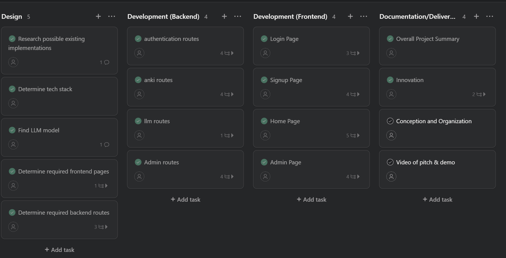
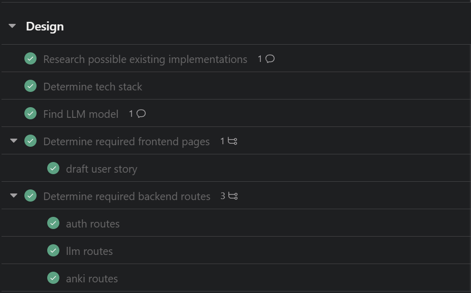
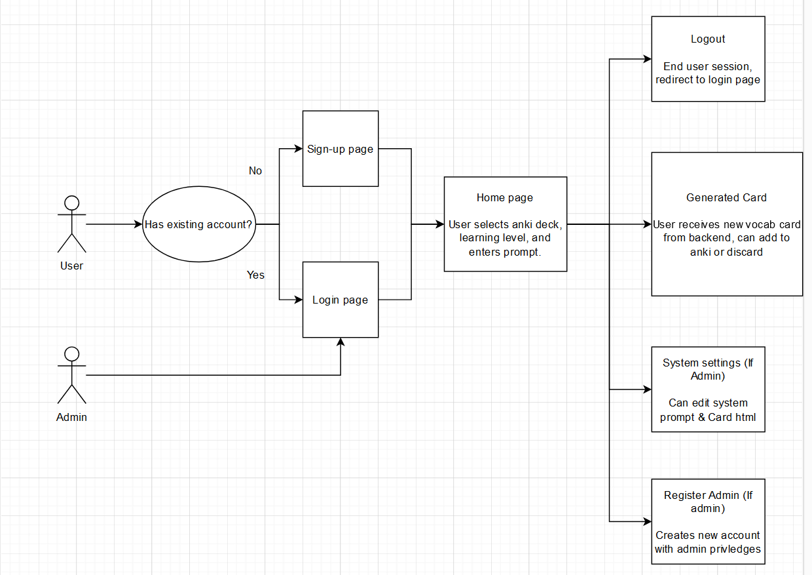
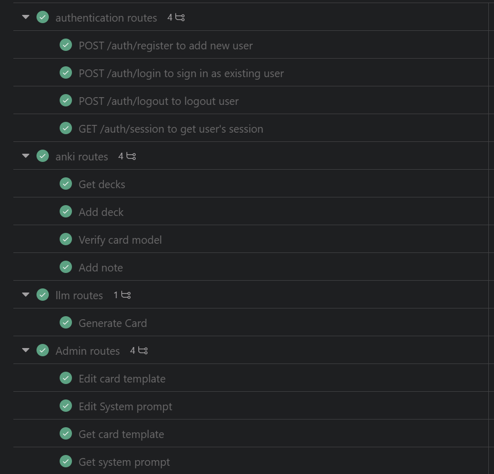
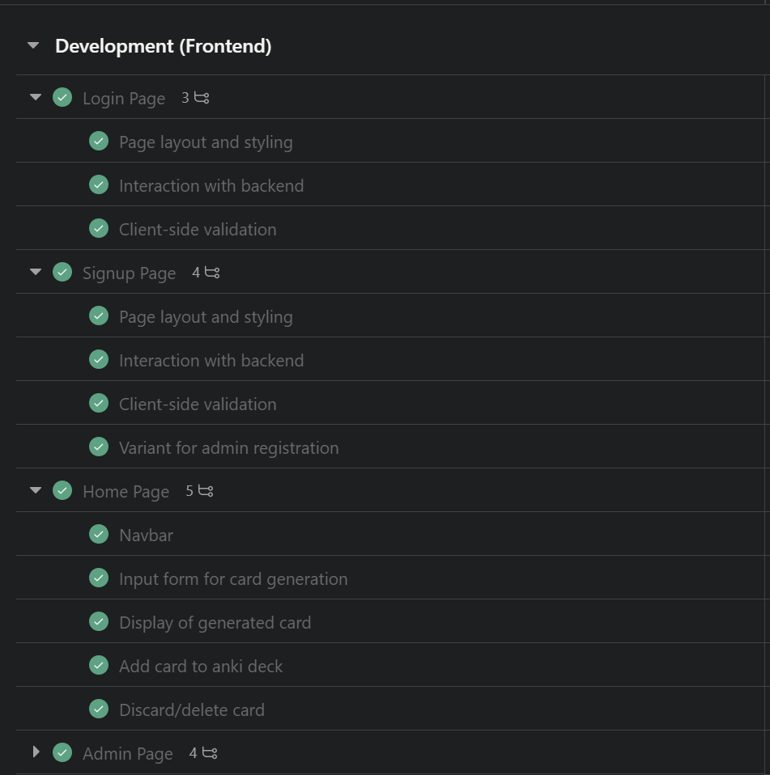
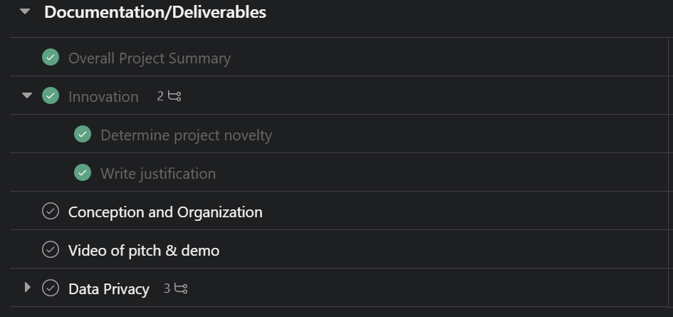

# B - Conception and Organization
After deciding on the project idea, the first step was to create a project in Asana to allow me to easily plan out the project and keep track of tasks. I then created a project plan with the following sections:
- [Design](#1-design-phase)
- [Development (Backend)](#2-development-backend)
- [Development (Frontend)](#3-development-frontend)
- [Documentation/Deliverables](#4-documentationdeliverables)

## 1. Design Phase
I seperated the design phase into the tasks pictured below, with the goal of ensuring that I had a clear plan for the project and what tools to use before moving on to development.

Based on my previous experience with React and NodeJS, I decided to use these technologies for the frontend and backend respectively along with MongoDB to store user data. I also decided to use the Meta Llama 3 8B Instruct model due to its ease of use with the gpt4all library and pretrained multilingual knowledge.

I then created a user story diagram to help visualize the user's journey through the application:

This diagram helped me to plan out the different pages and features that the application would need to have in order to suite the user's needs. I then seperated these features into individual Asana tasks to be completed during the development phase.

## 2. Development (Backend)
I seperated the backend development into four main sections, with the individual routes displayed as subtasks:

As I implemented each route, I made use of a [Postman Collection](https://www.postman.com/speeding-shuttle-145414/workspace/public/collection/32573845-e515023b-1e70-4c0d-abe4-7852f063875a?action=share&creator=32573845&active-environment=32573845-d07a5a89-111a-4841-8bb3-8a66d5705e48) to test the routes and ensure that they were functioning correctly.

## 3. Development (Frontend)
As with the backend, I seperated the frontend development by page, with the individual features displayed as subtasks:

## 4. Documentation/Deliverables
Upon completion of the development phase, I then started preparing the documentation and deliverables for the project. This included writing the README, creating a video demonstration, and addressing the project deliverables such as this document.

